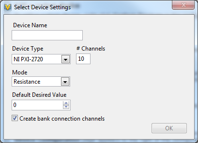
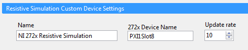
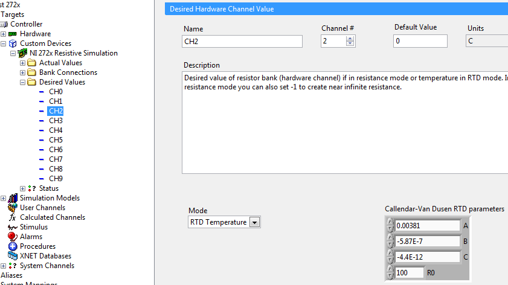

# Overview

**NI 272x Resistive Simulation Custom Device** integrates the NI 272x series resistive simulation hardware into NI VeriStand.
This custom device supports Windows, Pharlap RT and Linux RT targets.

 
 

# Repo location

[Github](https://github.com/NIVeriStandAdd-Ons/NI-272x-Resistive-Simulation-Custom-Device)

---
 

# Requirements

These drivers must be installed on the deployment computer/target to function:

- NI VeriStand 2019 or later
- NI-Switch 20.5 or later (For Linux RT)​​
---
 

# Add-on Specifics
## Add-on Configuration
1. Add the NI 272x Resistive Simulation Custom Device to the System Definition. When added a new device, a configuration dialog will be shown. You can choose a predefined 272x card or a custom channel configuration. In this dialog you also can also set the mode, default value and RTD simulation settings for each hardware channel. You can also select if you would like to create NI VeriStand channels for hardware resistor bank to bank connections.

   
 

2. Configure the device name and update rate on the main page.

   

3. If needed, set the simulation mode for individual channels by expanding the "Desired Values" section and selecting a channel:
"Resistance" sets resistance directly.
"RTD Temperature" sets resistance indirectly through a simulated RTD calculation based upon the RTD parameters specified

   
 

For more information on the 272x hardware, connector, bank and relay layout see the online [NI 272x Overview](https://www.ni.com/en-us/support/documentation/supplemental/12/ni-272x-overview.html)